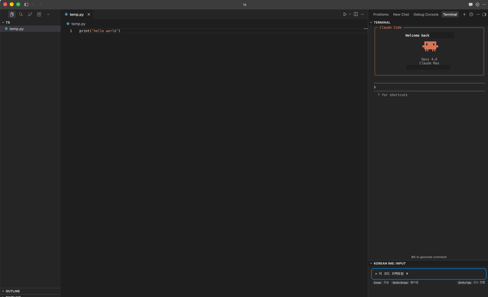

# Korean IME for Claude Code CLI

Fixes Korean IME input issues in VSCode/Cursor terminal when using Claude Code CLI.

## Problem

Korean IME composition breaks in Cursor/VSCode integrated terminal — characters get duplicated or corrupted when typing Korean in Claude Code CLI.

## Solution

A dedicated input panel at the bottom of the editor. Type Korean in the panel, press Enter, and the fully composed text is sent to the terminal. No more broken characters.

## Features

- **Korean Input Panel** — Bottom panel with proper IME composition support
- **Terminal Integration** — Sends composed text to the active terminal on Enter
- **Mode Switching** — `Shift+Tab` sends mode cycle command to Claude Code CLI
- **Multiline Support** — `Shift+Enter` for line breaks
- **Theme Sync** — Automatically matches terminal background color

## Quick Start

Available on **Cursor** marketplace.

1. Search `jamesoh.korean-ime-terminal` in the Extensions panel and install
2. Open Claude Code CLI in the terminal
3. Type Korean in the **Korean IME** panel at the bottom
4. Press `Enter` to send to terminal

## Keybindings

| Key | Action |
|---|---|
| `Enter` | Send text to terminal |
| `Shift+Enter` | Insert line break |
| `Shift+Tab` | Cycle Claude Code CLI mode |

## Settings

| Setting | Default | Description |
|---|---|---|
| `koreanIme.sendNewline` | `true` | Automatically sends Enter (newline) after input |

## License

MIT
