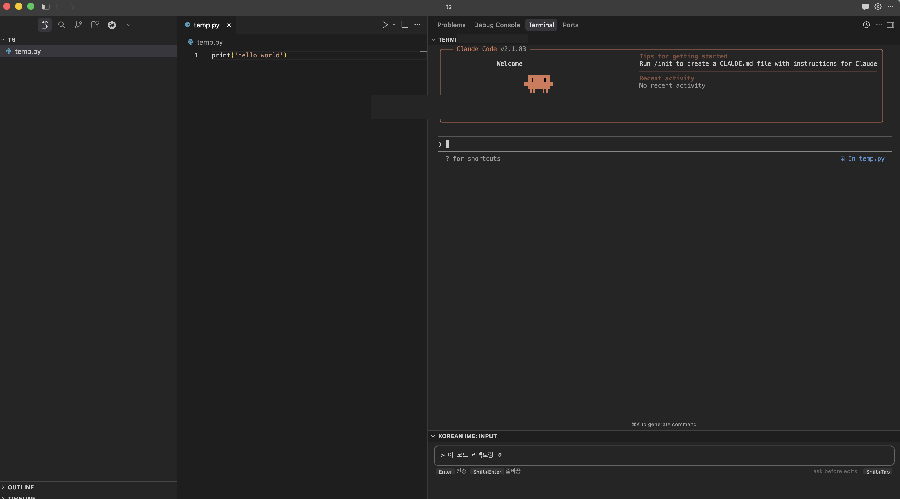
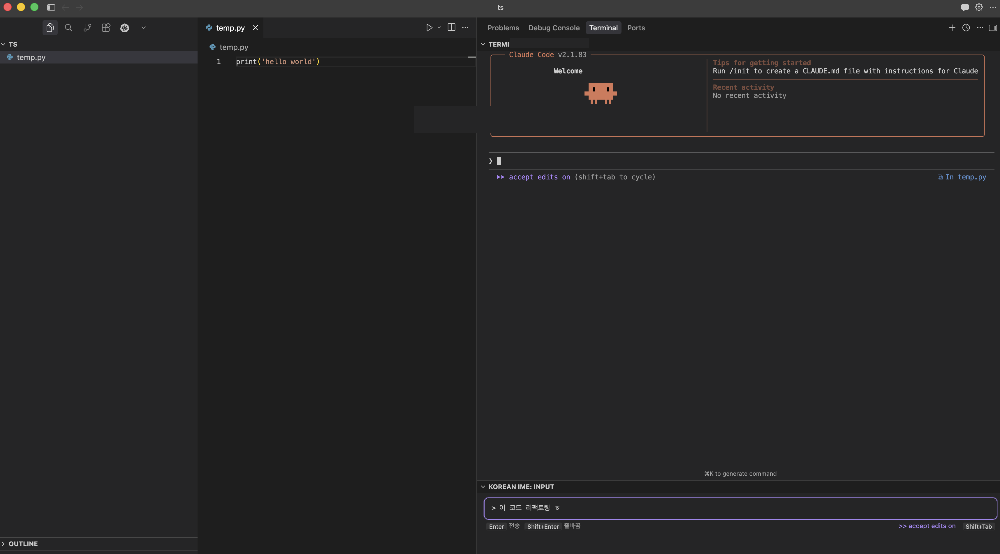
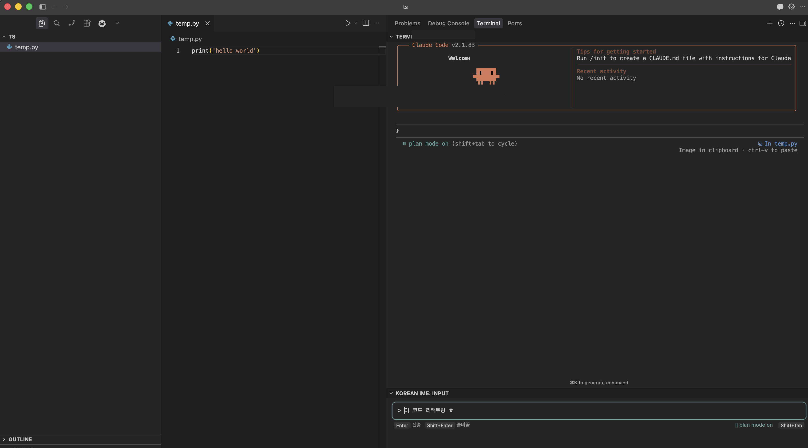

# Korean IME for Claude Code CLI

Fixes Korean IME input issues in VSCode/Cursor terminal when using Claude Code CLI.

## Problem

Korean IME composition breaks in Cursor/VSCode integrated terminal — characters get duplicated or corrupted when typing Korean in Claude Code CLI.

## Solution

A dedicated input panel at the bottom of the editor. Type Korean in the panel, press Enter, and the fully composed text is sent to the terminal. No more broken characters.

## Features

- **Korean Input Panel** — Bottom panel with proper IME composition support
- **Terminal Integration** — Sends composed text to the active terminal on Enter
- **Mode Switching** — Cycle through Claude Code CLI modes (plan mode, accept edits, ask before edits) with `Shift+Tab`, matching the CLI's native behavior
- **Mode Indicator** — Visually displays the current mode with matching colors from Claude Code CLI
- **Multiline Support** — `Shift+Enter` for line breaks
- **Theme Sync** — Automatically matches terminal background color

## Quick Start

1. Install the extension
2. Open Claude Code CLI in the terminal
3. Type Korean in the **Korean IME** panel at the bottom
4. Press `Enter` to send to terminal

## Keybindings

| Key | Action |
|---|---|
| `Enter` | Send text to terminal |
| `Shift+Enter` | Insert line break |
| `Shift+Tab` | Cycle mode (ask before edits → accept edits → plan mode) |

## Mode Switching

Matches Claude Code CLI's native mode indicator:

| Mode | Color |
|---|---|
| `ask before edits` | Gray |
| `>> accept edits on` | Violet |
| `|| plan mode on` | Teal |

**Ask before edits** (Gray)

**Accept edits** (Violet)

**Plan mode** (Teal)

## Settings

| Setting | Default | Description |
|---|---|---|
| `koreanIme.sendNewline` | `true` | Automatically sends Enter (newline) after input |

## License

MIT
